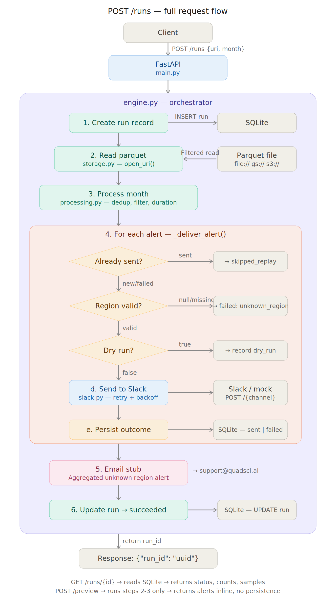

# Risk Alert Service

A cloud-deployable Python service that processes monthly account health data, identifies at-risk accounts, and delivers Slack alerts to region-specific channels with replay safety and retry logic.

## Architecture



**Request flow (POST /runs):**

1. **Create run record** — engine writes a run to SQLite with status `running`
2. **Read parquet** — storage layer reads the file via `open_uri()` with predicate pushdown and column projection (only loads months ≤ target, only needed columns)
3. **Process month** — deduplicate rows (keep latest `updated_at`), filter to `status == "At Risk"` above ARR threshold, compute consecutive duration per account by walking backward month-by-month
4. **Deliver each alert** — three sequential gates, each an early return:
   - **Idempotency check** — query SQLite; if already sent → `skipped_replay`
   - **Region routing** — look up channel; if null/unmapped → `failed: unknown_region`
   - **Dry run check** — if `dry_run=true` → record and skip send
   - **Slack send** — POST with exponential backoff retry on 429/5xx
   - **Persist outcome** — upsert sent/failed to SQLite
5. **Email notification** — aggregate all unknown-region alerts into a single report (written to `email_reports/` directory)
6. **Finalize run** — update SQLite with final counts, set status to `succeeded`

**Other endpoints:**
- `GET /runs/{id}` reads directly from SQLite — returns status, counts, and sample alerts/errors
- `POST /preview` runs steps 2-3 only — returns alerts inline with no persistence or Slack sends
- `GET /health` returns `{"ok": true}` — liveness check for container orchestrators

## Quickstart

### Prerequisites

- Python 3.11+
- pip

### Local setup

```bash
# Clone and install
git clone https://github.com/danielsihyun/risk_alert_service.git && cd risk_alert_service
python -m venv venv && source venv/bin/activate
pip install -r requirements.txt
```

### Start the services

**Terminal 1 — Mock Slack server:**
```bash
uvicorn mock_slack.server:app --host 0.0.0.0 --port 9000
```

**Terminal 2 — Alert service:**
```bash
export SLACK_WEBHOOK_BASE_URL="http://localhost:9000/slack/webhook"
uvicorn app.main:app --reload --port 8000
```

### Test the endpoints

**Terminal 3:**
```bash
# 1. Health check
curl -s http://localhost:8000/health | python3 -m json.tool

# 2. Preview
curl -s -X POST http://localhost:8000/preview \
  -H "Content-Type: application/json" \
  -d '{"source_uri": "file:///absolute/path/to/monthly_account_status.parquet", "month": "2026-01-01"}' \
  | python3 -m json.tool

# 3. Error handling — bad file path (expect 404)
curl -s -X POST http://localhost:8000/runs \
  -H "Content-Type: application/json" \
  -d '{"source_uri": "file:///nonexistent.parquet", "month": "2026-01-01"}' \
  | python3 -m json.tool

# 4. Error handling — unsupported scheme (expect 400)
curl -s -X POST http://localhost:8000/runs \
  -H "Content-Type: application/json" \
  -d '{"source_uri": "ftp:///bad.parquet", "month": "2026-01-01"}' \
  | python3 -m json.tool

# 5. Full run (sends Slack alerts) — capture run_id
RUN_ID_1=$(curl -s -X POST http://localhost:8000/runs \
  -H "Content-Type: application/json" \
  -d '{"source_uri": "file:///absolute/path/to/monthly_account_status.parquet", "month": "2026-01-01"}' \
  | python3 -c "import sys,json; print(json.load(sys.stdin)['run_id'])")
echo "Run 1: $RUN_ID_1"

# 6. Get run results
curl -s http://localhost:8000/runs/$RUN_ID_1 | python3 -m json.tool

# 7. Replay — run the same month again (verify idempotency) — capture run_id
RUN_ID_2=$(curl -s -X POST http://localhost:8000/runs \
  -H "Content-Type: application/json" \
  -d '{"source_uri": "file:///absolute/path/to/monthly_account_status.parquet", "month": "2026-01-01"}' \
  | python3 -c "import sys,json; print(json.load(sys.stdin)['run_id'])")
echo "Run 2: $RUN_ID_2"

# 8. Replay results — should show skipped_replay: 137, alerts_sent: 0
curl -s http://localhost:8000/runs/$RUN_ID_2 | python3 -m json.tool

# 9. Email reports — check unknown-region notification files
ls -la email_reports/
cat email_reports/unknown_region_report_*.txt

# 10. Mock Slack logs — verify message payloads and retries
curl -s "http://localhost:9000/logs?limit=5" | python3 -m json.tool
```

**Expected results:**
- Step 1: `{"ok": true}`
- Step 2: `total_alerts: 141`, `rows_scanned: 10587`, `duplicates_found: 308`
- Step 3: 404 — `"Data file not found"`
- Step 4: 400 — `"Unsupported URI scheme: ftp"`
- Step 6: `alerts_sent: ~137`, `failed_deliveries: 4`, `unknown_region: 4`
- Step 8: `alerts_sent: 0`, `skipped_replay: 137`, `sample_skipped` populated
- Step 9: Text files listing 4 null-region accounts (a00090, a00559, a00593, a00769)
- Step 10: Slack payloads showing retry behavior (429 → 200)

### Run unit tests

```bash
pytest tests/ -v
```

### Docker

```bash
docker build -t risk-alert-service .

# Run with local data mounted (mock Slack must be running on host port 9000)
docker run -p 8000:8000 \
  -v /path/to/risk_alert_service:/data \
  -e SLACK_WEBHOOK_BASE_URL="http://host.docker.internal:9000/slack/webhook" \
  risk-alert-service

# Test from host
curl -s -X POST http://localhost:8000/preview \
  -H "Content-Type: application/json" \
  -d '{"source_uri": "file:///data/monthly_account_status.parquet", "month": "2026-01-01"}'
```

## Configuration

All configuration is via environment variables. No secrets are hardcoded.

| Variable | Required | Default | Description |
|---|---|---|---|
| SLACK_WEBHOOK_BASE_URL | One of these required | — | Base URL mode: POSTs to {url}/{channel} |
| SLACK_WEBHOOK_URL | | — | Single webhook mode: POSTs to this URL |
| REGION_CHANNEL_MAP | No | See below | JSON mapping of region to Slack channel |
| ARR_THRESHOLD | No | 10000 | Minimum ARR to generate an alert |
| DETAILS_BASE_URL | No | https://app.yourcompany.com/accounts | Base URL for account detail links |
| DATABASE_URL | No | sqlite:///risk_alerts.db | SQLite connection string |
| SUPPORT_EMAIL | No | support@quadsci.ai | Recipient for unknown-region notifications |
| EMAIL_REPORT_DIR | No | ./email_reports | Directory for email report files |
| SLACK_MAX_RETRIES | No | 3 | Max retry attempts for Slack failures |
| SLACK_INITIAL_BACKOFF | No | 1.0 | Initial backoff in seconds |
| SLACK_BACKOFF_MULTIPLIER | No | 2.0 | Backoff multiplier per retry |
| SLACK_REQUEST_TIMEOUT | No | 10 | HTTP timeout in seconds |
| GOOGLE_APPLICATION_CREDENTIALS | For GCS | — | Path to GCP service account JSON |
| AWS_ACCESS_KEY_ID | For S3 | — | AWS access key (or use IAM role) |
| AWS_SECRET_ACCESS_KEY | For S3 | — | AWS secret key (or use IAM role) |
| AWS_DEFAULT_REGION | For S3 | — | AWS region (e.g., us-east-1) |

### Slack mode

If both `SLACK_WEBHOOK_BASE_URL` and `SLACK_WEBHOOK_URL` are set, base URL mode takes precedence. In base URL mode, messages are POSTed to `{SLACK_WEBHOOK_BASE_URL}/{channel_name}`.

### Region channel map

Default:
```json
{"AMER": "amer-risk-alerts", "EMEA": "emea-risk-alerts", "APAC": "apac-risk-alerts"}
```

Override via env var (supports both flat and nested formats):
```bash
export REGION_CHANNEL_MAP='{"AMER": "amer-risk-alerts", "EMEA": "emea-risk-alerts", "APAC": "apac-risk-alerts"}'
# or
export REGION_CHANNEL_MAP='{"regions": {"AMER": "custom-amer-channel"}}'
```

There is **no default channel**. Accounts with null or unmapped regions are recorded as failures and included in the aggregated email notification.

### GCS authentication

For `gs://` URIs, authenticate using one of:
```bash
# Service account key file
export GOOGLE_APPLICATION_CREDENTIALS=/path/to/service_account.json

# Workload Identity (GKE, Cloud Run) — no env var needed, auto-detected
```

### S3 authentication

For `s3://` URIs, authenticate using one of:
```bash
# IAM credentials (local dev / CI)
export AWS_ACCESS_KEY_ID=...
export AWS_SECRET_ACCESS_KEY=...
export AWS_DEFAULT_REGION=us-east-1

# IAM role (ECS, EKS, Lambda) — no env vars needed, auto-detected via instance metadata
```

## Design Decisions

### ARR threshold (default: $10,000)

The threshold filters low-value accounts to reduce alert noise. Analysis of the dataset:

- 158 At Risk accounts in January 2026
- 11 have ARR = $0 (likely inactive or churned accounts)
- No accounts fall between $1 and $10,000
- Setting the threshold at $10,000 removes all zero-ARR noise without excluding any legitimate at-risk accounts

Configurable via `ARR_THRESHOLD` for different customer environments.

### Replay safety

Idempotency is enforced at the database level with a unique constraint on `(account_id, month, alert_type)` in the `alert_outcomes` table.

On re-running the same month:
- **Previously sent** → `skipped_replay` (no duplicate Slack message)
- **Previously failed (Slack error)** → retried (failed alerts get another chance)
- **Previously failed (unknown_region)** → re-evaluated but will fail again if the region is still unmapped. These are re-counted in the run's `failed_deliveries` and `unknown_region` counters since the underlying issue persists until the region is added to the routing config.
- **Previously dry_run** → eligible for real send

It is always safe to re-run a month. If a run partially fails (e.g., some Slack sends timed out), re-running will skip the successful ones and retry only the failures.

**Concurrency note:** The service uses SQLite with a single module-level engine. For a containerized batch job that runs monthly, this is appropriate. For a production deployment handling concurrent requests, SQLite should be replaced with PostgreSQL and the session management updated to use FastAPI's dependency injection pattern.

### Unknown region handling

Accounts with null or unmapped regions:
1. Are **not** sent to any Slack channel
2. Are recorded as `failed` with reason `unknown_region`
3. Are aggregated into a **single notification** after the run completes

The notification is written to `email_reports/unknown_region_report_{run_id}.txt` and logged to the application console. In production, the file write in `app/email.py` would be replaced with a real email sender — the interface (`send_unknown_region_notification(alerts, run_id)`) stays the same, only the transport changes:
- **AWS SES** if deployed on AWS
- **SendGrid** or **Postmark** for vendor-neutral email
- **Google Workspace SMTP** if in a Google environment

### Scale awareness

The service uses Parquet-friendly access patterns to minimize memory usage:

- **Predicate pushdown**: only rows where `month <= target_month` are read. Future months are excluded at the Parquet level.
- **Column projection**: only the columns needed for processing are requested.
- **GCS temp file pattern**: for `gs://` URIs, the file is downloaded to a temp file so PyArrow can use memory-mapped I/O with predicate pushdown, rather than holding the entire blob in memory. For very large files (multi-GB), a more optimal approach would use `pyarrow.fs.GcsFileSystem` for direct row-group-level reads without downloading the full file. The current approach prioritizes simplicity and correctness over maximum throughput.

For the provided dataset (~10K rows), this is sufficient. For production datasets with millions of rows, the same patterns scale well because Parquet's columnar format and row-group filtering minimize I/O.

The storage abstraction (`app/storage.py`) supports all three URI schemes (`file://`, `gs://`, `s3://`) behind a single `open_uri()` interface. Both GCS and S3 use the same pattern: download to a temp file, then read with PyArrow's predicate pushdown. The service is designed to run as a containerized batch job via ECS Fargate, GKE, or Cloud Run, and the Dockerfile is compatible with both ECR and GCR.

### Slack retry strategy

Transient failures (HTTP 429 and 5xx) are retried with exponential backoff:

- Attempt 1: immediate
- Attempt 2: wait 1s
- Attempt 3: wait 2s
- Attempt 4: wait 4s
- Give up after 4 attempts total (configurable via `SLACK_MAX_RETRIES`)

If the response includes a `Retry-After` header, the service uses whichever is larger: the header value or the calculated backoff. Non-retryable errors (4xx other than 429) fail immediately.

## Example Output

Full example responses are in the [`examples/`](examples/) directory:
- [`preview_response.json`](examples/preview_response.json) — POST /preview
- [`run_response.json`](examples/run_response.json) — GET /runs/{run_id} (first run)
- [`replay_response.json`](examples/replay_response.json) — GET /runs/{run_id} (replay, proving idempotency)

### POST /preview

```json
{
  "month": "2026-01-01",
  "source_uri": "file:///data/monthly_account_status.parquet",
  "rows_scanned": 10587,
  "duplicates_found": 308,
  "total_alerts": 141,
  "arr_threshold": 10000,
  "alerts": [
    {
      "account_id": "a00636",
      "account_name": "Account 0636",
      "account_region": "EMEA",
      "arr": 10211,
      "duration_months": 2,
      "risk_start_month": "2025-12-01",
      "renewal_date": "2026-06-01",
      "account_owner": "owner36@example.com",
      "channel": "emea-risk-alerts",
      "routable": true
    },
    {
      "account_id": "a00090",
      "account_name": "Account 0090",
      "account_region": null,
      "arr": 49917,
      "duration_months": 2,
      "risk_start_month": "2025-12-01",
      "renewal_date": null,
      "account_owner": "owner40@example.com",
      "channel": null,
      "routable": false
    }
  ]
}
```

### GET /runs/{run_id}

```json
{
  "run_id": "bc54d6b9-84f4-4689-9947-8d6f07b2ec11",
  "source_uri": "file:///data/monthly_account_status.parquet",
  "month": "2026-01-01",
  "dry_run": false,
  "status": "succeeded",
  "started_at": "2026-04-05T22:08:50.960875",
  "completed_at": "2026-04-05T22:08:53.036634",
  "error": null,
  "counts": {
    "rows_scanned": 10587,
    "duplicates_found": 308,
    "alerts_generated": 141,
    "alerts_sent": 137,
    "skipped_replay": 0,
    "failed_deliveries": 4,
    "unknown_region": 4
  },
  "sample_alerts": [
    {
      "account_id": "a00636",
      "account_name": "Account 0636",
      "channel": "emea-risk-alerts",
      "status": "sent",
      "sent_at": "2026-04-05T22:08:51.046988"
    }
  ],
  "sample_errors": [
    {
      "account_id": "a00090",
      "account_name": "Account 0090",
      "channel": null,
      "status": "failed",
      "error": "unknown_region"
    }
  ],
  "sample_skipped": []
}
```

### GET /runs/{run_id} — replay (same month, second run)

```json
{
  "run_id": "54e7bc15-a733-483c-b5a5-9182848c18c9",
  "source_uri": "file:///data/monthly_account_status.parquet",
  "month": "2026-01-01",
  "dry_run": false,
  "status": "succeeded",
  "started_at": "2026-04-05T22:08:53.074208",
  "completed_at": "2026-04-05T22:08:53.253071",
  "error": null,
  "counts": {
    "rows_scanned": 10587,
    "duplicates_found": 308,
    "alerts_generated": 141,
    "alerts_sent": 0,
    "skipped_replay": 137,
    "failed_deliveries": 4,
    "unknown_region": 4
  },
  "sample_alerts": [],
  "sample_errors": [
    {
      "account_id": "a00090",
      "account_name": "Account 0090",
      "channel": null,
      "status": "failed",
      "error": "unknown_region"
    }
  ],
  "sample_skipped": [
    {
      "account_id": "a00636",
      "account_name": "Account 0636",
      "status": "sent"
    },
    {
      "account_id": "a00076",
      "account_name": "Account 0076",
      "status": "sent"
    }
  ]
}
```

## Project Structure

```
risk_alert_service/
├── app/
│   ├── __init__.py
│   ├── main.py            # FastAPI routes — thin HTTP layer
│   ├── engine.py           # Orchestrator — wires all modules together
│   ├── processing.py       # Business logic: dedup, filtering, duration calc
│   ├── storage.py          # URI abstraction: file://, gs://, s3://
│   ├── slack.py            # Slack client: formatting, routing, retry
│   ├── email.py            # Unknown-region notification (stub + file output)
│   ├── config.py           # Centralized env var configuration
│   └── db.py               # SQLite persistence: runs + alert_outcomes
├── mock_slack/
│   ├── __init__.py
│   ├── server.py           # Mock Slack webhook server (test infrastructure)
│   └── README.md
├── examples/
│   ├── preview_response.json   # Example POST /preview output
│   ├── run_response.json       # Example GET /runs/{id} output
│   └── replay_response.json    # Example replay output (idempotency proof)
├── tests/
│   ├── __init__.py
│   └── test_processing.py  # Unit tests for core business logic
├── Dockerfile
├── requirements.txt
├── architecture.png        # Architecture diagram
├── .gitignore
├── README.md
├── monthly_account_status.parquet
└── monthly_account_status_sample.csv
```

Each module has a single responsibility and no knowledge of the others (except `engine.py` which orchestrates them all):

- **storage.py** — reads files, knows nothing about alerts or Slack
- **processing.py** — transforms data, knows nothing about storage or delivery
- **slack.py** — sends messages, knows nothing about data processing
- **db.py** — persists records, knows nothing about business logic
- **email.py** — formats and writes notifications, knows nothing about Slack
- **config.py** — loads env vars, used by all modules
- **engine.py** — the only module that imports all others; orchestrates the pipeline
- **main.py** — thin HTTP layer that delegates to engine
